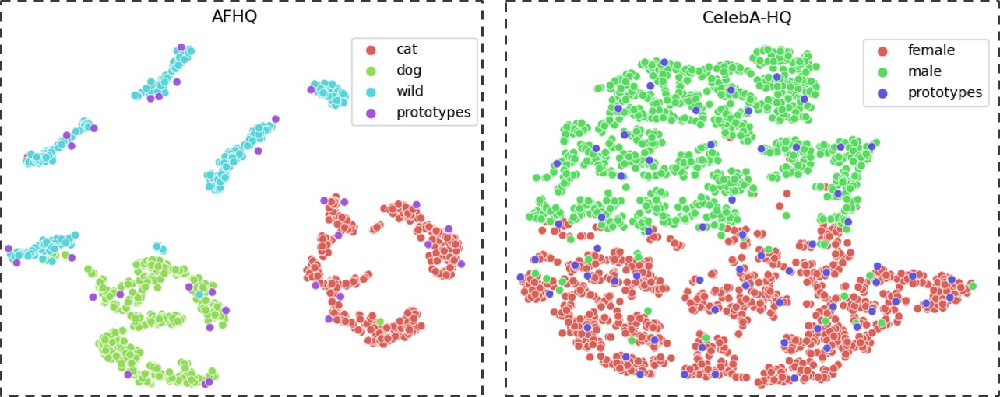

# A Style-aware Discriminator for Controllable Image Translation

[Kunhee Kim](https://www.kunheekim.xyz), Sanghun Park, Eunyeong Jeon, Taehun Kim, Daijin Kim  
POSTECH

<p align="center">
  
</p>

> Our model discovers various style prototypes from the dataset in a self-supervised manner. The style prototype consists of a combination of various attributes including (left) time, weather, season, and texture; and (right) age, gender, and accessories.

> **Paper:** https://arxiv.org/abs/2203.15375

> **Abstract:** *Current image-to-image translations do not control the output domain beyond the classes used during training, nor do they interpolate between different domains well, leading to implausible results. This limitation largely arises because labels do not consider the semantic distance. To mitigate such problems, we propose a style-aware discriminator that acts as a critic as well as a style encoder to provide conditions. The style-aware discriminator learns a controllable style space using prototype-based self-supervised learning and simultaneously guides the generator. Experiments on multiple datasets verify that the proposed model outperforms current state-of-the-art image-to-image translation methods. In contrast with current methods, the proposed approach supports various applications, including style interpolation, content transplantation, and local image translation.*

## Installation / Requirements

- CUDA 10.1 or newer is required for the [StyleGAN2](https://arxiv.org/abs/1912.04958)-based model since it uses custom CUDA kernels of StyleGAN2 ported by [@rosinality](https://github.com/rosinality/stylegan2-pytorch).
- We mainly tested on Python 3.8 and 1.10.2 with cudatoolkit=11.3 (see [environment.yml](environment.yml)) with CUDA 11.2 for custom CUDA kernel.

Clone this repository:

```bash
git clone https://github.com/kunheek/style-aware-discriminator.git
cd style-aware-discriminator
```

Then, install dependencies using anaconda or pip:

```bash
conda env create -f environment.yml
# or
pip install -r requirements.txt
```

## Testing and Evaluation

We provide the following pre-trained networks.

|                    | Dataset     | Resolution | Method    | #images | OneDrive link |
|--------------------|-------------|------------|-----------|---------|---------|
| afhq-adain         | AFHQ        | $256^2$    | AdaIN     | 1.6 M   | [afhq-adain.pt](https://o365kaist-my.sharepoint.com/:u:/g/personal/kunheekim_office_kaist_ac_kr/EXXn2WmxRTNMuHwEip_7ISYBZP0yjIGLEdrnXRpWq_4_vw?e=Q79XI7) |
| afhq-stylegan2     | AFHQ        | $256^2$    | StyleGAN2 | 5 M     | [afhq-stylegan2-5M.pt](https://o365kaist-my.sharepoint.com/:u:/g/personal/kunheekim_office_kaist_ac_kr/EYFJoQILF8ZPvVla5CUMzzcBKwFJKOnOYmS92VxE--0PQg?e=qqKov4) |
| afhqv2             | AFHQ v2     | $512^2$    | StyleGAN2 | 5 M     | [afhqv2-512x512-5M.pt](https://o365kaist-my.sharepoint.com/:u:/g/personal/kunheekim_office_kaist_ac_kr/EQZWO4260J9DlRqJvGNLZ8gBJ_yzzPlXjiWFcDbxMdSIAA?e=qrmtaC) |
| celebahq-adain     | CelebA-HQ   | $256^2$    | AdaIN     | 1.6 M   | [celebahq-adain.pt](https://o365kaist-my.sharepoint.com/:u:/g/personal/kunheekim_office_kaist_ac_kr/Ef6XeyapXGdDgxNz36PDYBwBgOdZ4KfZq3lSd1Ak0qAOKA?e=ORFas5) |
| celebahq-stylegan2 | CelebA-HQ   | $256^2$    | StyleGAN2 | 5 M     | [celebahq-stylegan2-5M.pt](https://o365kaist-my.sharepoint.com/:u:/g/personal/kunheekim_office_kaist_ac_kr/EXmytLCR6-ZMkzcROcRmQk8Bcb4lbSMVmspydMV4CjNJuQ?e=0CrzKJ) |
| church             | LSUN church | $256^2$    | StyleGAN2 | 25 M    | [church-25M.pt](https://o365kaist-my.sharepoint.com/:u:/g/personal/kunheekim_office_kaist_ac_kr/EagzHup1K2ZFsKVzwHswg4cBxkYphYVkxZjAtMirFqfb4Q?e=Fi82ap) |
| ffhq               | FFHQ        | $256^2$    | StyleGAN2 | 25 M    | [ffhq-25M.pt](https://o365kaist-my.sharepoint.com/:u:/g/personal/kunheekim_office_kaist_ac_kr/EUREXa2eJlpLgbEUyr5usFoB5XAKGx_5enx42ozIeJoatQ?e=RoRRL4) |
| flower             | Oxford 102  | $256^2$    | AdaIN     | 1.6 M   | [flower-256x256-adain.pt](https://o365kaist-my.sharepoint.com/:u:/g/personal/kunheekim_office_kaist_ac_kr/EWc9bn6MiSJAh_yzQxVvwUIBN8rckJ0mi_IO1BuIwYqmKA?e=yK87ZZ) |

Here are links to all checkpoints ([checkpoints.zip](https://o365kaist-my.sharepoint.com/:u:/g/personal/kunheekim_office_kaist_ac_kr/EX0kn7Wq86BBsAXSu1SYZw4BOhQOVQ8Jua_jBSo8eDyvsQ?e=xGUvkP)) and MD5 file ([checkpoints.md5](https://o365kaist-my.sharepoint.com/:u:/g/personal/kunheekim_office_kaist_ac_kr/EQmPZINooDFEmCQivbQMMxgB-TzZPwaGsiupy1i8T2rToA?e=igYPBP)).
If you have `wget` and `unzip` in your environment, you can also download the checkpoints using the following command:

```bash
# download all checkpoints.
bash download.sh checkpoints
# download a specific checkpoint.
bash download.sh afhq-adain
```

See the table above or [download.sh](download.sh) for available checkpoints.

### Quantitative results

(Optional) Computing inception stats requires long time. We provide pre-calculated stats for AFHQ 256 and CelebA-HQ 256 datasets ([link](https://o365kaist-my.sharepoint.com/:u:/g/personal/kunheekim_office_kaist_ac_kr/EcoST7aF9ppJvTEAK8135p8BZEDzz42Q4J9hTfSf99x6rA?e=OXWRgf)). You can download and register them using the following command:

```bash
bash download.sh stats
# python -m tools.register_stats PATH/TO/STATS
python -m tools.register_stats assets/stats
```

To evaluate our model run `python -m metrics METRICS --checkpoint CKPT --train-dataset TRAINDIR --eval-dataset EVALDIR`. By default, all metrics will be saved in `runs/{run-dir}/metrics.txt`. Available metrics are:

- [fid](metrics/fid_evaluator.py): FID and KID (`--eval-kid true`)
- [mean_fid](metrics/mean_fid_evaluator.py): mFID and mKID (`--eval-mkid true`)
- [fid_lerp](metrics/fid_lerp_evaluator.py): FID_lerp
- [reconstruction](metrics/reconstruction_evaluator.py): MSE and LPIPS
- [knn](metrics/knn_evaluator.py): k-NN accuracy

See `metrics/{task}_evaluator.py` for task specific options. You can parse multiple tasks at the same time. Here are some examples:

```sh
python -m metrics fid reconstruction --seed 123 --checkpoint ./checkpoints/afhq-stylegan2-5M.pt --train-dataset ./datasets/afhq/train --eval-dataset ./datasets/afhq/val

python -m metrics mean_fid --seed 777 --checkpoint ./checkpoints/celebahq-stylegan2-5M.pt --train-dataset ./datasets/celeba_hq/train --eval-dataset ./datasets/celeba_hq/val
```

### Qualitative results

You can synthesize images similarly to the quantitave evaluations (replace `metrics` to `synthesis`). By default, all images will be saved in `runs/{run-dir}/{task}` folder.

```bash
# python -m synthesis [TASKS] --checkpoint PATH/TO/CKPT --folder PATH/TO/FOLDERS
python -m synthesis swap --checkpoint ./checkpoints/afhq-stylegan2-5M.pt --folder ./testphotos/afhq/content ./testphotos/afhq/style

python -m synthesis interpolation --checkpoint ./checkpoints/afhq-stylegan2-5M.pt --folder ./testphotos/afhq/content ./testphotos/afhq/style
```

Some tasks require multiple folders (*e.g.*, content and style) or extra arguments. Available synthesis tasks are:

- [prototype](synthesis/prototype_synthesizer.py): synthesize images using the images in the folder and leanred prototypes.
- [swap](synthesis/swap_synthesizer.py): translate the first folder (source) using the second folder (reference).
- [interpolation](synthesis/interpolation_synthesizer.py): synthesize images using interpolated style code.
- [local_translation](synthesis/local_translation_synthesizer.py)
- [transplantation](synthesis/transplantation_synthesizer.py)

### Additional tools

We provide additional tools for visualizing the learned style space:

- [plot_tsne](tools/plot_tsne.py): visualize the learned style space and prototypes using t-SNE.

<p align="center">
  
</p>

```bash
python -m tools.plot_tsne --checkpoint checkpoints/afhq-stylegan2-5M.pt --target-dataset datasets/afhq/val --seed 7 --title AFHQ --labels cat dog wild

python -m tools.plot_tsne --checkpoint checkpoints/celebahq-stylegan2-5M.pt --target-dataset datasets/celeba_hq/val --seed 7 --title CelebA-HQ --legends female male
```

- [similarity_search](tools/similarity_search.py): find samples that are most similar to the query (in the style space and the content space) in the target dataset.

```bash
python -m tools.similarity_search --checkpoint CKPT --query QUERY_IMAGE --target-dataset TESTDIR
```

## Training

### Datasets

- [*AFHQ*](https://arxiv.org/abs/1912.01865), [*AFHQ v2*](https://arxiv.org/abs/2106.12423), and [*CelebA-HQ*](https://github.com/tkarras/progressive_growing_of_gans) datasets can be downloaded [here](https://github.com/clovaai/stargan-v2#datasets-and-pre-trained-networks)
- [*FFHQ*](https://github.com/NVlabs/ffhq-dataset) datasets can be downloaded [here](https://github.com/NVlabs/ffhq-dataset#download-script)
- [*LSUN*](https://www.yf.io/p/lsun) *churches* can be downloaded [here](https://github.com/fyu/lsun)

By default, all images in the folder will be used for training or evaluation (supported image formats can be found [here](mylib/misc.py#L5)). For example, if you parse `--train-dataset=./datasets/afhq/train`, all images in the `./datasets/afhq/train` folder will be used for training.  
For LSUN datasets, `lsun` must be included in the folder path.  

```txt
datasets
└─ lsun
   ├─ church_outdoor_train_lmdb
   └─ church_outdoor_val_lmdb
```

To measure `mean fid`, a subdirectory corresponding to each class must exist (less than 5). If you want to reproduce experiments in the paper, we recommend to use the following structure:

```txt
datasets
├─ afhq
│  ├─ train
│  │  ├─ cat
│  │  ├─ dog
│  │  └─ wild
│  └─ val (or test)
│     └─ (cat/dog/wild)
└─ celeba_hq
   ├─ train
   │  ├─ female
   │  └─ male
   └─ val
      └─ (female/male)
```

### Training scripts

**Notice**: We recommend training networks on a single GPU with enough memory (*e.g.*, A100) to obtain best results, since we observed performance degradation with current implementation when using multiple GPUs (DDP). For example, a model trained on a A100 GPU (40GB) is slightly better than a model trained on two TITAN XP GPU (12GB * 2). We used a single NVIDIA A100 GPU for AFHQ and CelebA-HQ experiments and four NVIDIA RTX3090 GPUs for AFHQ v2, LSUN churches, and FFHQ experiments. Note that we disabled [tf32](https://pytorch.org/docs/stable/notes/cuda.html#tensorfloat-32-tf32-on-ampere-devices) for all experiments.

We provide training scripts [here](scripts/). Use the following commands to train networks with custom arguments:

```bash
# Single GPU training.
python train.py --mod-type adain --total-nimg 1.6M --batch-size 16 --load-size 320 --crop-size 256 --image-size 256 --train-dataset datasets/afhq/train --eval-dataset datasets/afhq/val --out-dir runs --extra-desc some descriptions

# Multi-GPU training.
CUDA_VISIBLE_DEVICES=0,1,2,3 torchrun --nproc_per_node=4 train.py --total-nimg 25M --batch-size 64 --load-size 320 --crop-size 256 --image-size 256 --train-dataset datasets/ffhq/images1024x1024 --eval-dataset datasets/ffhq/images1024x1024 --nb-proto 128 --latent-dim 512 --latent-ratio 0.5 --jitter true --cutout true --out-dir runs --extra-desc some descriptions
```

Training options, codes, checkpoints, and snapshots will be saved in the `{out-dir}/{run-id}-{dataset}-{resolution}-{extra-desc}`. Please see [train.py](train.py#L18), [model.py](model/model.py#21), and [augmentation.py](model/augmentation.py#12) for available arguments.

To resume training, run `python train.py --resume PATH/TO/RUNDIR`. For example:

```bash
# Single GPU training.
python train.py --resume runs/000-afhq-256x256-some-discriptions

# Multi-GPU training.
CUDA_VISIBLE_DEVICES=0,1,2,3 torchrun --nproc_per_node=4 python train.py --resume runs/001-ffhq-some-discriptions
```

## Citation

If you find this repository useful for your research, please cite our paper:

```bibtex
@InProceedings{kim2022style,
  title={A Style-Aware Discriminator for Controllable Image Translation},
  author={Kim, Kunhee and Park, Sanghun and Jeon, Eunyeong and Kim, Taehun and Kim, Daijin},
  booktitle={Proceedings of the IEEE/CVF Conference on Computer Vision and Pattern Recognition (CVPR)},
  year={2022},
  pages={18239--18248}
}
```

## Acknowledgements

Many of our implementations are adapted from previous works, including [SwAV](https://github.com/facebookresearch/swav), [DINO](https://github.com/facebookresearch/dino), [StarGAN v2](https://github.com/clovaai/stargan-v2), [Swapping Autoencoder](https://github.com/taesungp/swapping-autoencoder-pytorch), [clean-fid](https://github.com/GaParmar/clean-fid), and [stylegan2-pytorch](https://github.com/rosinality/stylegan2-pytorch).

## Licenses

All materials except custom CUDA kernels in this repository are made available under the [MIT License](LICENSE).

The custom CUDA kernels ([fused_bias_act_kernel.cu](model/networks/stylegan2_op/fused_bias_act_kernel.cu) and [upfirdn2d_kernel.cu](model/networks/stylegan2_op/upfirdn2d_kernel.cu)) are under the [Nvidia Source Code License](https://nvlabs.github.io/stylegan2/license.html), and are for non-commercial use only.
